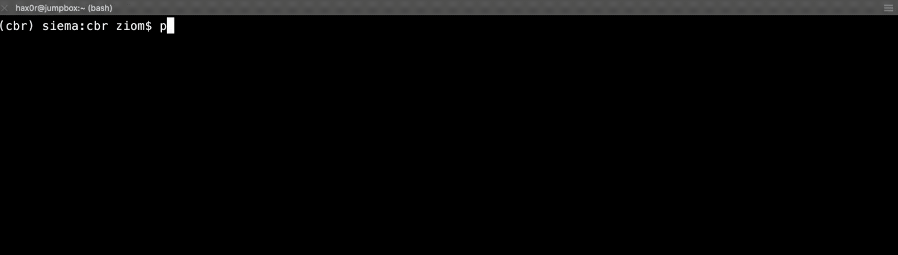

## Intro

For our hackathon, the NWA (Nerds with Attitude - creative, I know...) team came up with an idea we're calling Cb Trap (killing it with the creativity! /s). Before we get into the details of the project, let me explain why something like this is needed. So, grab a beer, put on your favorite EDM mix (if you're like me, you're well prepared and created a 10 hour loop of [this](https://www.youtube.com/watch?v=sUtoxEZvPyY)), and try to stay awake :D

You've just been notified by law enforcement about your organization being breached. How the attackers gained access isn't relevant for now, however like many breaches, they've been in your environment for well over 6 months and exfiltrated a considerable amount of data. After the notification, you hire an incident response (IR) firm to help investigate the matter and come up with a remediation plan.

Large scale incident response can take several weeks to investigate, and implementing remediation steps can take even longer. During this time, you witness the attacker entering and leaving your network on an almost daily basis. One day, you notice the attacker has compressed 5G of the CTO's emails and is preparing to exfiltrate them. At this point, you're not ready for the eradication phase of the IR process (you don't want to show your hand before you're sure you've identified the scope of the compromise), however, you also don't want to see 5G worth of emails leaving the environment.

To buy the teams more time, you decide to manually corrupt the archive and allow the attacker to exfiltrate the corrupted data. This is a _huge_ win and gives the team enough time to finish the remediation steps without losing data, but doesn't scale well in enterprise environments. What if there was a product that enabled you to do this with ease?!

## Cb Trap

Cb Trap leverages [cbapi](https://cbapi.readthedocs.io/en/latest/) to perform this in an automated fashion.

### Attacker/Victim - first attempt

Below is a fairly realistic demo from the attackers point of view before using Cb Trap. First, the attacker sets up a Command and Control server to listen for incoming connections. Then, a user at your organization opens a malicious Word document (sent from the attacker) and clicks to enable macro's. This runs malicious VBA and establishes Command and Control communciation with the attacker's server. The attacker then introduces an archive utility, uses it to archive files from the system, downloads and views your sensitive data:


Your information was just stolen.

### Security/IR Team

To combat this problem, we wrote a DLL that will hook the read input into every hard-coded program, and feed it junk instead of the real data. We used this DLL, along with a Python script that leverages the cbapi in order to deploy it (this is a POC so it's dirty, and the DLL had some dependencies we had to write to disk, too. Again, POC):

```python
from cbapi.response import *


cb = CbResponseAPI()
input_sensor = raw_input("Enter hostname:")
sensor = cb.select(Sensor).where("hostname:"+input_sensor).first()

try:
    print("[*] Establishing CbLR session with host...")
    sensor_session = sensor.lr_session()
    print("[!] CbLR session established!")
    print("[*] Copying files to host...")
    sensor_session.put_file(open("rr_hook.dll", "rb"), r"c:\rr_hook.dll")
    sensor_session.put_file(open("vcruntime140d.dll", "rb"),
                            r"C:\Windows\SysWOW64\vcruntime140d.dll")
    sensor_session.put_file(open("ucrtbased.dll", "rb"),
                            r"C:\Windows\SysWOW64\ucrtbased.dll")
    print("[!] Copy successful!")
    print("[*] Setting appinit regkey...")
    sensor_session.set_registry_value(
        "HKLM\\SOFTWARE\\Wow6432Node\\Microsoft\\Windows NT\\CurrentVersion\\Windows\\AppInit_DLLs", "c:\\rr_hook.dll", overwrite=True, value_type=None)
    sensor_session.set_registry_value(
        "HKLM\\SOFTWARE\\Wow6432Node\\Microsoft\\Windows NT\\CurrentVersion\\Windows\\LoadAppInit_DLLs", "00000001", overwrite=True, value_type='REG_DWORD')
    print("[*] Registry set.\n[!] Host has been configured!")
except Exception, e:
    print(e)
```

And here you can see the script in action:



That's it!

### Attacker/Victim - second attempt

Once Cb Trap has been deployed, you can see the attacker attempt the same technique to collect the same files. However, notice the contents of the files have been corrupted with random data:


Although your information was stolen, it's all junk. You're safe for now.

## Credit

Credit goes to members of NWA:  

* Eazy B (aka Brian Sturk)
* Dr. 'Red (aka Jared Myers)
* Ice Noob (aka Adam Nadrowski aka Riding-Brian's-and-Jared's-Coat-Tails-Since-Day-1)
